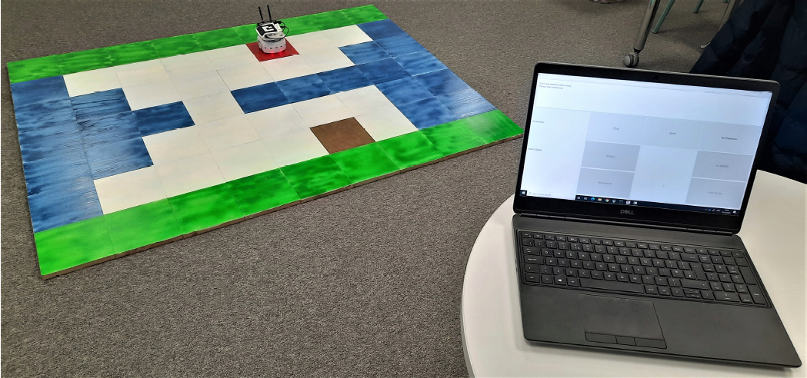

# JPAL-HA

[**Justified Human Preferences for Active Learning with Hypothetical Actions (JPAL-HA)**](https://eprints.soton.ac.uk/454808/) is an human-in-the-loop algorithm for safe agent learning in safety-critical environments. It builds on the **Parenting** algorithm from [(Frye et al., 2019)](https://arxiv.org/pdf/1902.06766.pdf), augmenting it with two novel and generalisable ideas: **Justifications** and **Hypothetical Actions**. In this repository, you can select to run simulation or user experiments with any of the three algorithms:

- **Parenting** (Preferences)
- **JPAL** (Preferences + Justifications)
- **JPAL-HA** (Preferences + Justifications + Hypothtical Actions)

For the user experiments, you may optionally use a GUI, a microphone or a Thymio robot.

### Files

- _jpal_main.py_: Main module including the main logic of the algorithm. Use this file to run simulation or user experiments but without a GUI.

- _jpal.py_: Includes
  - all mechanisms of the Agent:
    - ask BTFQs
    - recording
    - ask ATFQs
    - direct policy learning

    with optionally using:
    - Justifications 
    - Hypothetical Actions
    
  - the policy Model
  
- _human_substitute.py_: A module for substituting the real human with a simulated one by computing the optimal Q-values and returning the values and information regarding the human.

- _client.py_: Includes the Client class for connecting with a server (raspberry pi) which connects with the Thymio robot for the real-word experiment.

- _my_island_navigation.py_: Slightly modified [_island_navigation.py_](https://github.com/deepmind/ai-safety-gridworlds/blob/master/ai_safety_gridworlds/environments/island_navigation.py) from [AI Safety Gridworlds](https://github.com/deepmind/ai-safety-gridworlds) to enable passing a modified configuration of the Island Navigation environment as argument.

- _in_qtable.json_: Stored pretrained q-values which give the optimal policy for the modified Island Navigation environment

- _jpal_main_gui.py_: Main module similar to jpal_main.py, but also using the GUI. Optionally, can use a Thymio robot if available.

- _jpal_gui.py_: similar to jpal.py, but also includes the GUI (created with  [PySide6](https://pypi.org/project/PySide6/)) for the user to interact with the agent

- _server_controller.py_: Module running in Raspberry Pi for a real-world experiment with a Thymio robot. Implements the server to receive input from the user and the controller (adapted from [here](https://github.com/lebalz/thympi/blob/master/example/thympi.py)) to move the robot.

- _controller.aesl_: Aseba program for doing on-robot computations

### Usage
Coded in Python 3.9 and Pytorch 1.8.1. Please use numpy==1.22.3. Newer versions might complain.

Dependencies for running the code: **AI Safety Gridworlds**, **Abseil-py**, **Pycolab**

1. Get the [AI Safety Gridworlds](https://github.com/deepmind/ai-safety-gridworlds) and set up the python path to it
2. Install the Abseil package: `pip install absl-py`
3. Download and install [Pycolab](https://github.com/deepmind/pycolab) from source (dependency on AI Safety Gridworld environments): `python setup.py install`
4. For windows: `pip install windows-curses`
5. You can run simulation experiments with a simulated user by running _jpal_main.py_ and setting there

   `USE_REAL_HUMAN = False`
   `USE_SPEECH_RECOGNITION = False`
   `USE_THYMIO = False`

6. You may choose an algorithm to run amongst '_Parenting_', '_JPAL_' or '_JPAL-HA_', e.g. by setting in  _jpal_main.py_

   `ALGORITHM = 'JPAL-HA'`

### Running an experiment with a real user
1. You can run an experiment with input from the keyboard by running _jpal_main.py_ and setting
`USE_REAL_HUMAN = True`
2. For running an experiment using the GUI (recommended)
    - install [PySide6](https://pypi.org/project/PySide6/) by running `pip install PySide6`
    - run _jpal_main_gui.py_ (again set `USE_REAL_HUMAN = True`)
3. For giving input by natural language from a microphone using speech recognition (optional)
    1. follow instructions in [Python Voice Assistant Tutorial #1 - Playing Sound with gTTS (Google Text to Speech)](https://www.youtube.com/watch?v=-AzGZ_CHzJk&t=327s):
       - `pip install SpeechRecognition`
       - `pip install gTTS`
       - `pip install playsound`
       - `pip install pyaudio` (if not installed, download appropriate version of [PyAudio](https://www.lfd.uci.edu/~gohlke/pythonlibs/#pyaudio) and run `pip install <name of .whl file downloaded>`
    2. if you run it from _jpal_main_gui.py_, press "_Push To Talk_" in the interface and say the same exact command as the option shown in the interface (e.g. _North_, _East_, _No Warning_, etc.)
4. To run an experiment with a [Thymio robot](https://www.thymio.org/) you need to control it from a Python script running on a Raspberry PI.
    1. You need to have _aseba_ and _dbus_ installed on your Raspberry PI. For detailed explanations you may read [D-Bus access using asebamedulla](http://aseba.wikidot.com/en:asebamedulla) and an [example controlling Thymio II from Python running on Raspberry PI](http://aseba.wikidot.com/en:thymioraspyexample).
        - From this [repository](https://github.com/lebalz/thympi) run the commands to install aseba and it's dependencies:
           - `sudo dpkg -i aseba_1.5.5_armhf.deb`
           - `sudo apt-get update && sudo apt-get -f install`
           - `sudo apt-get install python-dbus` (dbus)
           - `sudo apt-get install python-gtk2` (glib)
        - run on your raspberry pi: `python3 server_controller.py`, where the server to receive commands from the user's computer and the controller to move Thymio are programmed. You need to have the file _controller.aesl_ in the same directory.
    2. in _jpal_main.py_ or _jpal_main_gui.py_ set `USE_THYMIO = True` and run the file
 
        

